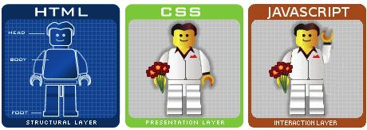

# *JavaScript(JS):

JS: is an asynchronous dynamically typed, Interpreted scripting language, designed to make web pages dynamic & interactive(programming language) .

*JavaScript frameworks*  are an essential for modern **front-end web development**, it provides developers with proven tools for building scalable, interactive web applications.

**Java Script** runs on the client side of the web, which can be used to design / program how the web pages behave on the occurrence of an event.it is an **easy** to learn and also powerful scripting language, widely used for controlling web page behavior.

It's not "Interpreted Java". In a nutshell, JavaScript is a dynamic scripting language supporting prototype based object construction. The basic syntax is similar to both *Java and C++* to reduce the number of new concepts required to learn the language
Language constructs, such as if statements, for and while loops, and switch and try ... catch blocks function the same as in these languages (or nearly so). 

## JavaScript data types and data structures
JavaScript is a **loosely typed and dynamic language**. Variables in JavaScript are not directly associated with any particular value type, and any variable can be assigned (and re-assigned) values of all types.

JavaScript provides three different value-comparison operations: 

* strict equality using _**===**_
*  loose equality using _**==**_
* the Object.is() method.

### Data and Structure types:

1. *Undefined* : represents undefined value. 

2. *Boolean* : represents boolean value eihter _**false or true**_. 

3. *Number* : represents numeric values. for example: **14**.

4. *String* : represents sequence of characters.for example: **"hello"**.

5. *Null*: represents null. for example: **no value at all**. 
6. *Symbol* : is created by invoking the function symbol, which dynamically produces an anonymous, unique value.

7. *Object* :it is simply a collection of properties in the form of name and value pairs.

>Vist [developer.mozillat](https://developer.mozilla.org/en-US/docs/Web/JavaScript) for more information.

or

 > visit [code-maven](https://code-maven.com/input-output-in-plain-javascript)
