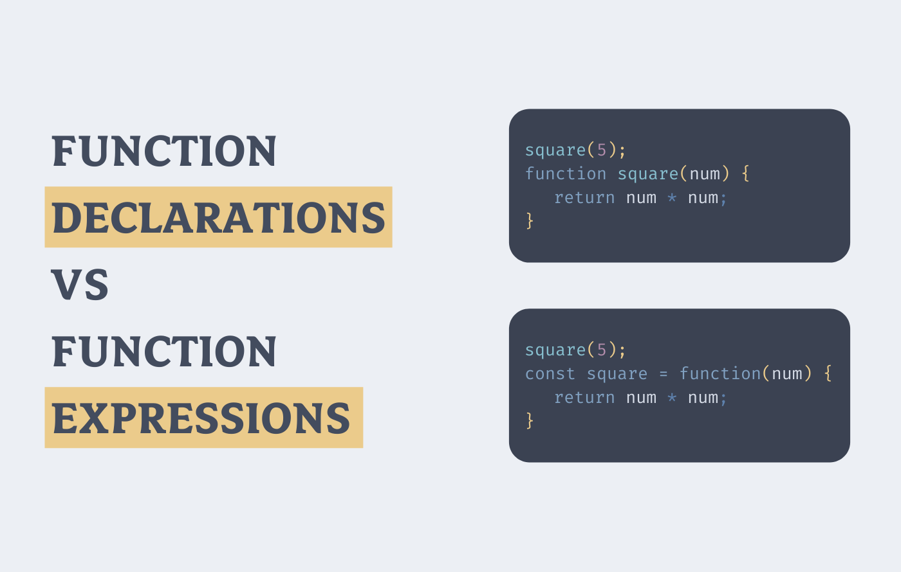

# *Expressions and operators:

-JavaScript has the following types of operators:

* *Assignment operators*(=): it _**assigns**_ a value to its left operand based on the value of its right operand.
That is, x = y assigns the value of y to x.

* *Comparison operators*: it compares its operands and returns a logical value based on whether the comparison is true. The operands can be numerical, string, logical, or object values

* *Arithmetic operators* : it takes numerical values (either literals or variables) as their operands and returns a single numerical value.

* *Bitwise operators* : it  treats their operands as a set of 32 bits (zeros and ones), rather than as decimal, hexadecimal, or octal numbers.

* *Logical operators*(&& and ||):typically used with Boolean (logical) values; when they are, they return a Boolean value. 
operators actually return the value of one of the specified operands.
* *String operators*.

* *Conditional (ternary)* : it is the only JavaScript operator that takes **three operands**. The operator can have one of two values based on a condition.

* *Comma operator*: (,) evaluates both of its operands and returns the value of the last operand. This operator is primarily used inside a for loop, to allow multiple variables to be updated each time through the loop. 

* *Unary operators*: it is an operation with only one operand.

* *Relational operators*: it compares its operands and returns a Boolean value based on whether the comparison is true.

For more information visit
[developer.mozilla](https://developer.mozilla.org/en-US/docs/Web/JavaScript/Guide/Expressions_and_Operators).

## Functions:
In JavaScript, functions are **first-class objects**, because they can have properties and methods just like any other object.

A function in JavaScript is similar to a *procedure*—a set of statements that performs a task or calculates a value, but for a procedure to qualify as a function, it should take some input and return an output where there is some obvious relationship between the input and the output.

🙄

### *Defining functions:🤩

There are several ways to define functions:

1. **function declaration** :it defines a function with the specified parameters.

2. **function expression**: is similar to and has the same syntax as a function declaration,but  Function expressions are not hoisted, unlike function declarations. You can't use function expressions before you create them.

-Functions consists of the `function`keyword, followed by:

* The name of the function.
* A list of parameters(The name of an argument to be passed to the function) to the function, enclosed in parentheses and separated by commas.
* The JavaScript statements that define the function, enclosed in curly brackets, {...}.

To return a value other than the default, a function must have a `return` statement that specifies the value to return.

> For more information visit [developer.mozilla](https://developer.mozilla.org/en-US/docs/Web/JavaScript/Reference/Functions).

## *Control flow:

_The control flow_: is the order in which the computer executes statements in a script.(Code is run in order from the first line in the file to the last line).

A typical script in JavaScript includes many control structures, including conditionals, **loops**( a sequence of instructions that is continually repeated until a certain condition is met in computer programming) and **functions**.

Example:

for(var i = 0; i < 10; i++){

  console.log(i)

}

This loop will print numbers 0-9, will stop when condition is met (i = 10)

> For more information visit [developer.mozilla](https://developer.mozilla.org/en-US/docs/Glossary/Control_flow).

## *Function Invocation:

**The code inside the function will execute when "something" invokes (calls) the function:**

* When an event occurs (when a user clicks a button).
* When it is invoked (called) from JavaScript code.
* Automatically (self invoked).

-Function Return:
When JavaScript reaches a `return` statement, the function will **stop executing**.

### Why Functions?
1. You can reuse code: Define the code once, and use it many times.

2. You can use the same code many times with different arguments, to produce different results.
