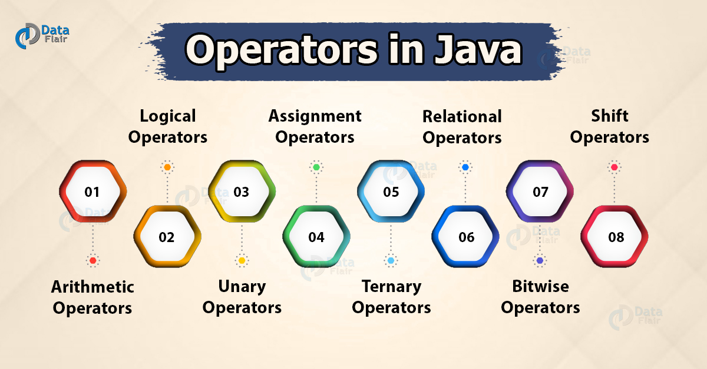
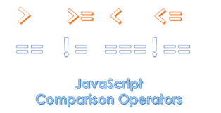
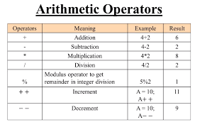
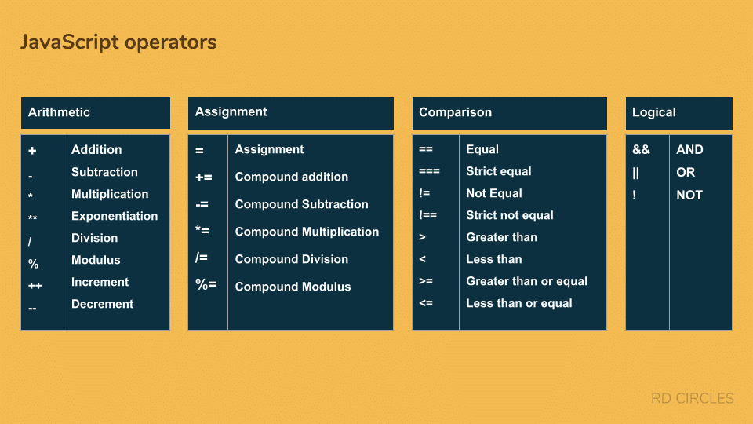

# *Expressions and operators:

-JavaScript has the following types of operators:

* *Assignment operators*(=): it _**assigns**_ a value to its left operand based on the value of its right operand.
That is, x = y assigns the value of y to x.

* *Comparison operators*: it compares its operands and returns a logical value based on whether the comparison is true. The operands can be numerical, string, logical, or object values

* *Arithmetic operators* : it takes numerical values (either literals or variables) as their operands and returns a single numerical value.

* *Bitwise operators* : it  treats their operands as a set of 32 bits (zeros and ones), rather than as decimal, hexadecimal, or octal numbers.

* *Logical operators*(&& and ||):typically used with Boolean (logical) values; when they are, they return a Boolean value. 
operators actually return the value of one of the specified operands.
* *String operators*.

* *Conditional (ternary)* : it is the only JavaScript operator that takes **three operands**. The operator can have one of two values based on a condition.

* *Comma operator*: (,) evaluates both of its operands and returns the value of the last operand. This operator is primarily used inside a for loop, to allow multiple variables to be updated each time through the loop. 

* *Unary operators*: it is an operation with only one operand.

* *Relational operators*: it compares its operands and returns a Boolean value based on whether the comparison is true.

For more information visit
[developer.mozilla](https://developer.mozilla.org/en-US/docs/Web/JavaScript/Guide/Expressions_and_Operators).
# *Loops and iteration:

**Loops**: is the way to do something _repeatedly_.

-There are many different kinds of loops, but they all essentially do the same thing: they repeat an action some number of times. (Note that it's *possible* that number could be *zero*!)

-**The statements for loops provided in JavaScript are**:

* *for statement:* 
When a `for` loop executes, the following occurs:
1. The initializing expression `initialExpression`, if any, is executed. This expression usually initializes one or more loop counters, but the syntax allows an expression of any degree of complexity. This expression can also declare variables.
2. The `conditionExpression` expression is evaluated. If the value of conditionExpression is true, the loop statements execute. If the value of `condition` is false, the `for` loop terminates. (If the `condition` expression is omitted entirely, the condition is assumed to be true.)
3. The `statement` executes. To execute multiple statements, use a block statement `({ ... })` to group those statements.
4. If present, the update expression `incrementExpression `is executed.
5. Control returns to Step 2.

* *do...while statement*: The do...while statement repeats until a specified condition evaluates to false.

* *while statement*: A while statement executes its statements as long as a specified condition evaluates to true.

* *labeled statement*:A `label `provides a statement with an identifier that lets you refer to it elsewhere in your program.For example, you can use a label to identify a loop, and then use the break or continue statements to indicate whether a program should interrupt the loop or continue its execution. 

* *break statement*: Use the `break` statement to terminate a loop, `switch`, or in conjunction with a labeled statement.

-When you use `break` without a label, it terminates the innermost enclosing `while`, `do-while`, `for`, or `switch` immediately and transfers control to the following statement.

-When you use `break` with a label, it terminates the specified labeled statement.

* *continue statement*: The `continue` statement can be used to restart a while, do-while, for, or label statement.

* *for...in statement*: The for...in statement iterates a specified variable over all the enumerable properties of an object. For each distinct property, JavaScript executes the specified statements.

>For more information visit [developer.mozilla](https://developer.mozilla.org/en-US/docs/Web/JavaScript/Guide/Loops_and_iteration).